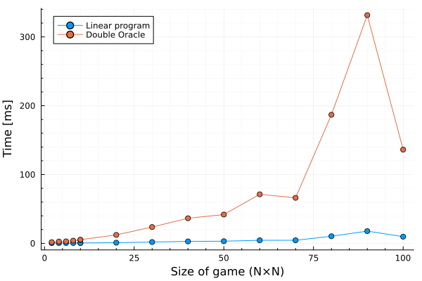
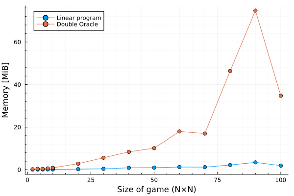
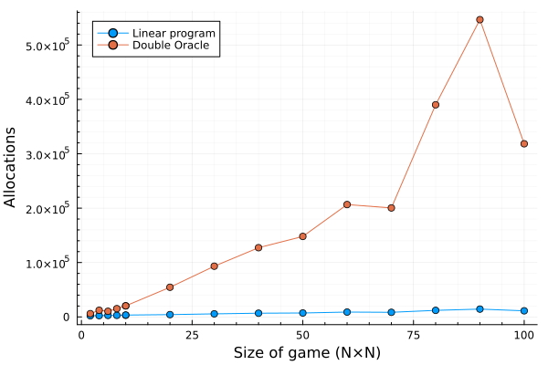
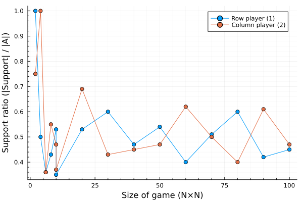

# Benchmarks

This page shows and compares performance of both algorithms.

## Experiments

Performance of both algorithms was measured by the `@benchmark` macro and from that, the median trial was taken.
Larger games were created subsequently and solved by both algorithms.
The resulting statistics are shown in the graphs below.

Size of each game depends on a parameter ``c = {2, 4, 6, 8, 10, 20, 30, 40, 50, 60, 70, 80, 90, 100}``.
The number of rows and columns is then randomly drawn from an uniform interval of integers ``[c, 2c]``.

Time, memory, allocations were observed. Moreover, ratio of *support* actions to the total number of actions was tracked for each solution.

## Analysis

As can be seen on this plot, the Linear programming method greatly outperforms the Double Oracle algorithm.

Moreover, the time plots are very similar to the graphs showing number of allocations and allocated memory.
This is caused mainly by repeatedly constructing the restricted matrices and the smaller linear programs.
This could be improved by using views into the original matrix instead of creating smaller copies.

However, it is quite likely, that for even larger games, the linear program itself would be so large, it would not fit into the memory.
In this situation, the Double Oracle algorithm could start to perform better as it almost never constructs the whole LP formulation.

The last plot confirms shows the number of actions present in equilibrium strategy of both players.
The points oscilate around the value 0.5 meaning that an equilibrium strategy contains something about half of all actions.
This is quite a large portion of actions and can be behind the poor performance of DO algorithm.
To solve the game, the algorithm has to perform at least N/2 oracle updates for each player and thus solve a large number of linear programs.

This could be partially amended by starting from a larger subset of actions and not from a single action.
This being said, the DO algorithm is meant for games where a large portion of actions is not in the support of an equilibrial strategy.
